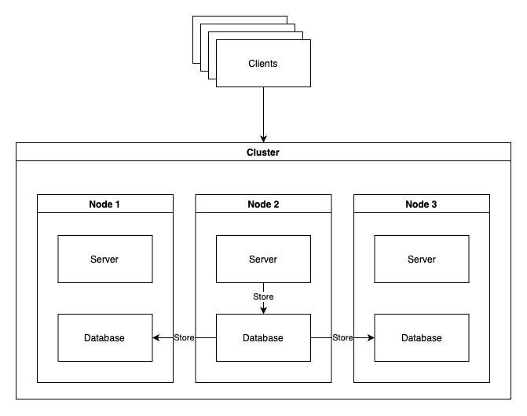
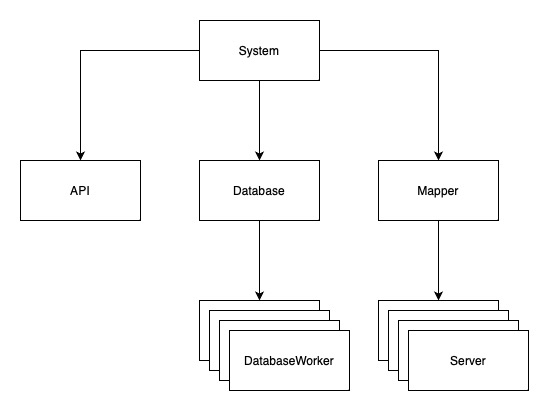
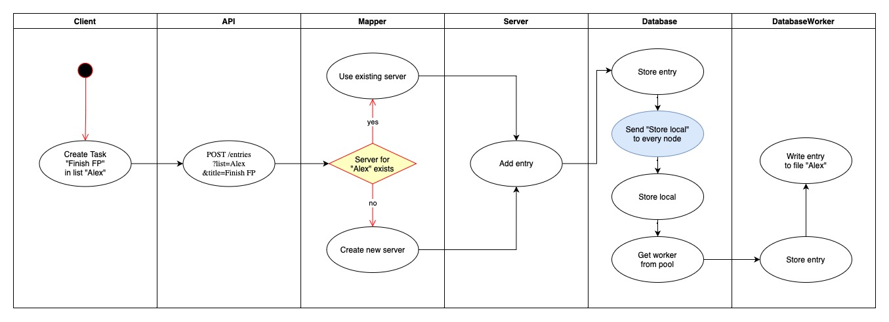

# Лабораторная работа №4

## Цель работы

Получить навыки работы со специфичными для выбранной технологии/языка программирования приёмами.

## Личная цель

Моей целью не является разработка очень крутого приложения с большим смыслом и практическим применением. Здесь я хотел познакомиться с основными принципами и инструментами для разработки распределенных систем на Elixir. 

## Описание

### Веб-сервер

Поддерживает два endpoint'а:

- `GET /entries?list=<name>` - получить заметки из списка `<name>`
- `POST /entries?list=<name>&title=<title>` - добавить заметку `<title>` в список `<name>`

Каждый список обрабатывается отдельным процессом.

### База данных

- Создается на каждом узле.
- Списки хранятся в виде отдельного бинарного файла `data/nodeXXX/list_name`. Это сделано для удобной сериализации и десериализации.
- Использует пул `Worker`'ов для работы с данными.
- Поддерживается репликация: данные записываются сразу во все узлы.

## Запуск

Запуск первого узла на порту 8181:

```shell
$ TAKSER_PORT=8181 iex --sname node1@localhost -S mix
```

Запуск второго узла на порту 8282:

```shell
$ TASKER_PORT=8282 iex  --sname node2@localhost -S mix
```

Соединение узлов:

```shell
iex(node2@localhost)1> Node.connect(:node1@localhost)
true
```

Чтобы подключить больше узлов, достаточно подключить каждого из них к любому из предыдущих. Тогда они все будут соединены:

```shell
$ TASKER_PORT=8383 iex  --sname node3@localhost -S mix
```

```shell
iex(node3@localhost)1> Node.connect(:node2@localhost)
true
iex(node3@localhost)2> Node.list()
[:node2@localhost, :node1@localhost]
```

## Пример работы

Три узла работают на портах 8181, 8282 и 8383 соответственно.

```shell
NODE_1=localhost:8181
NODE_2=localhost:8282
NODE_3=localhost:8383
```

Создаем заметку, обратившись к первому узлу:

```shell
$ curl -X POST -G \
"$NODE_1/entries" \
-d 'list=Alex' \
-d 'title=Finish%20FP'
OK
```

Проверим, действительно ли она сохранилась на первом узле:

```shell
$ curl -X GET -G \
"$NODE_1/entries" \
-d 'list=Alex'
1. Finish FP
```

Проверим, есть ли она на втором узле:

```shell
$ curl -X GET -G \
"$NODE_2/entries" \
-d 'list=Alex'
1. Finish FP
```

Создадим заметку, обратившись к третьему узлу:

```shell
$ curl -X POST -G \
"$NODE_3/entries" \
-d 'list=Bob' \
-d 'title=Prepare%20to%20Modeling'
OK
```

Проверим, есть ли она на втором узле:

```shell
$ curl -X GET -G \
"$NODE_2/entries" \
-d 'list=Bob'
1. Prepare to Modelin
```

## Архитектура

### Кластер



### Приложение



### Диаграмма активностей 



## CAP

### [V] Согласованность

Достигается благодаря репликации данных. Каждый узел записывает изменения не только у себя, но и у других узлов.

### [X] Доступность

В системе нет балансировщика. Обращение к данным происходит по адресу конкретного узла. Если он выйдет из строя, то ему придется обращаться к другим узлам.

### [V] Устойчивость к разделению

Если отвалился какой-то из узлов, то система в целом продолжит работать. 

## Выводы

Эта лабораторная была самой интересной, так как она позволила понять, чем же Elixir так хорош.

Из коробки предоставляется большое количество инструментов, которые позволяют легко создавать процессы и управлять ими. Это позволяет быстро разрабатывать отказоустойчивые кластеры.

Самое тяжелое - это поиск информации. У Elixir не такое большое сообщество, поэтому пришлось по крупицам собирать ее из форумов, чатов и книг. Многие ответы были нерелевантными из-за несовместимости с новыми версиями языка или библиотек.

В остальном все понравилось - лабораторная позволила с другой стороны посмотреть на разработку приложений. После фреймворков Python'а это очень необычно.
